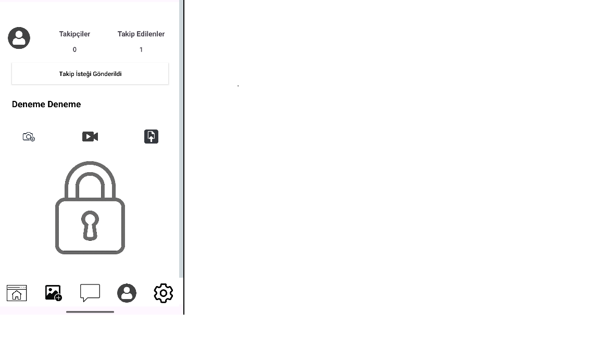

# SharingPhoto Android App

An Android social media app where users can share posts, like, comment, and follow other users. This project is built using **Kotlin** and **Android Studio**.

---

## Features

- User authentication and profile management
- Create, view, and edit posts (text, image, video)
- Like, comment, and share posts
- Follow/unfollow users
- Saved posts functionality
- Notifications system
- Clean and modern UI

---

## Screenshots

  
  
  
  
  
  
  
  

---

